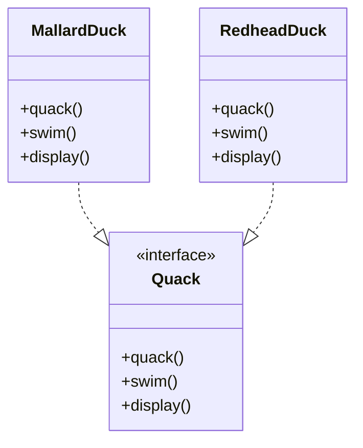
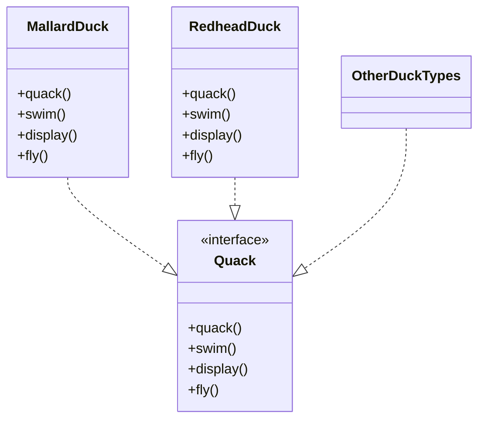

# Design Pattern is Rust

## SimDuckTown Case: Initial Design Phase

Shelly, a recent graduate from the University of Edinburgh, has joined StarxSim as a Junior Developer. As part of her onboarding, she was assigned her first project: to design and implement a simulation game titled SimDuckTown. The purpose of the project is to provide a foundational environment for practicing object-oriented design and behavior-driven modeling.
Initial Design Overview

Shelly began by identifying core behaviors common to all ducks and encapsulated these within a Quack interface. She then created two specific duck types that implement this interface. The initial UML class diagram is as follows:

## Design Review Feedback

Shelly presented the initial design to her manager, John, who serves as the Senior Manager on the team. During the review, John raised a new gameplay requirement: *ducks in SimDuckTown should also be able to fly*.

To accommodate this, the design would need to evolve and Shelly did errors. John turned to Abishek, a trusted senior engineer and graduate of IIT Bangalore, to propose a solution that would keep the system flexible and scalable. Abishek recommended enhancing the existing interface to incorporate flying behavior.

The updated UML design was proposed as follows:

### Unexpected Outcome

Shortly after implementing the change, an unexpected issue arose. During a live demo presented by John to the company’s CTO and a group of senior engineers, a RubberDuck—previously not part of the core design—was shown flying.

This inconsistency sparked immediate concern, as it violated real-world logic: Rubber ducks don’t fly.

The incident prompted a reassessment of the design. The team realized that tying behaviors directly to the duck types via a common interface lacked the flexibility needed to support varying capabilities across different duck types.

# Coming to the solution.

The day after Roland at daily standp, a german veteran from the team, explained two basic principles that can be applied in this situation to make further progress in the SimDuckTown and the miss that team did while he was in vacation:
 1. Identify the aspects of yuour application that vary and separate them from what stay the same. In this game *quack* and *fly* are the method
 that change, since there are ducks that don't fly and ducks that don't quack.
 2. Program to interface and implemetations. Use traits. A *trait* defines the functionality a particular type has and can share with other types. We can use traits to define shared behavior in an abstract way. We can use trait bounds to specify that a generic type can be any type that has certain behavior.


Ducks can have different flying and quacking behaviors that can be swapped at runtime.

## 📁 Structure

- Traits for `FlyBehavior` and `QuackBehavior`
- Implementations like `FlyWithWings`, `FlyNoWay`, `Quack`, `MuteQuack`
- `Duck` struct with dynamic behaviors
- Specific duck types like `MallardDuck`, `RubberDuck`, `ModelDuck`

---

## 🦀 Rust Code

```rust
use std::rc::Rc;

trait Duck {
    fn display(&self);
    fn swim(&self);
}

trait FlyBehavior {
    fn fly(&self);
}

trait QuackBehavior {
    fn quack(&self);
}

// --- Fly Behavior Implementations ---
struct FlyWithWings;
impl FlyBehavior for FlyWithWings {
    fn fly(&self) {
        println!("I'm flying with wings!");
    }
}

struct FlyNoWay;
impl FlyBehavior for FlyNoWay {
    fn fly(&self) {
        println!("I can't fly.");
    }
}

struct FlyRocketPowered;
impl FlyBehavior for FlyRocketPowered {
    fn fly(&self) {
        println!("I'm flying with a rocket!");
    }
}

// --- Quack Behavior Implementations ---
struct Quack;
impl QuackBehavior for Quack {
    fn quack(&self) {
        println!("Quack!");
    }
}

struct MuteQuack;
impl QuackBehavior for MuteQuack {
    fn quack(&self) {
        println!("...");
    }
}

struct Squeak;
impl QuackBehavior for Squeak {
    fn quack(&self) {
        println!("Squeak!");
    }
}

// --- Duck Struct ---
struct Duck {
    fly_behavior: Rc<dyn FlyBehavior>,
    quack_behavior: Rc<dyn QuackBehavior>,
    name: String,
}

impl Duck {
    fn new(name: &str, fly: Rc<dyn FlyBehavior>, quack: Rc<dyn QuackBehavior>) -> Self {
        Duck {
            name: name.to_string(),
            fly_behavior: fly,
            quack_behavior: quack,
        }
    }

    fn perform_fly(&self) {
        self.fly_behavior.fly();
    }

    fn perform_quack(&self) {
        self.quack_behavior.quack();
    }

    fn set_fly_behavior(&mut self, fb: Rc<dyn FlyBehavior>) {
        self.fly_behavior = fb;
    }

    fn set_quack_behavior(&mut self, qb: Rc<dyn QuackBehavior>) {
        self.quack_behavior = qb;
    }

    fn display(&self) {
        println!("I'm a {}!", self.name);
    }
}

// --- Duck Types ---
fn create_mallard_duck() -> Duck {
    Duck::new("Mallard Duck", Rc::new(FlyWithWings), Rc::new(Quack))
}

fn create_rubber_duck() -> Duck {
    Duck::new("Rubber Duck", Rc::new(FlyNoWay), Rc::new(Squeak))
}

fn create_model_duck() -> Duck {
    Duck::new("Model Duck", Rc::new(FlyNoWay), Rc::new(MuteQuack))
}

// --- Main Example ---
fn main() {
    let mut mallard = create_mallard_duck();
    mallard.display();
    mallard.perform_fly();
    mallard.perform_quack();

    println!("\n--- Rubber Duck ---");
    let rubber_duck = create_rubber_duck();
    rubber_duck.display();
    rubber_duck.perform_fly();
    rubber_duck.perform_quack();

    println!("\n--- Model Duck ---");
    let mut model_duck = create_model_duck();
    model_duck.display();
    model_duck.perform_fly();
    println!("Upgrading model duck with rocket power...");
    model_duck.set_fly_behavior(Rc::new(FlyRocketPowered));
    model_duck.perform_fly();
}
